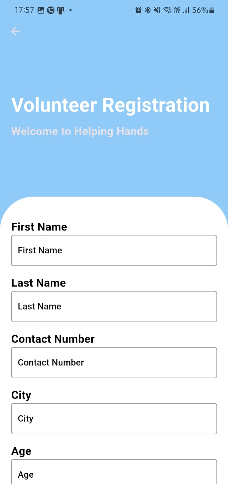

# Qlimate Guard 
## A software solution built on the SDG - *Climate Action* 
### Our app features a number of features that solve **two** major problems - disaster help and disaster awareness. We do so by:- 
#### 1. Providing **localised** help to people stuck in disaster, and setting up a volunteer management system to help the needy.
#### 2. Promoting climate awareness by giving information about important metrics like **AQI - Air Quality Index** , **Carbon  Footprint** and other **natural calamities**.

## Features
### Home Screen:- 

The home screen has four features, namely    
1. AQI Calculator  
2. Carbon Footprint Calculator  
3. Get help  
4. Weather  
5. Helping hands  
6. And an AI generated quote on climate awarness :))

### Air Quality Index Screen:-

This tool displays the air quality index of the air around your location. Not only that, it also gives a small informative text about how good or bad it is for the people and what adverse effects it can have on your health.

### Carbon Footprint Screen:-
 

This tool helps to calculate the carbon footprint you generated if you took a trip that used a variety of vehicle types. For each trip you can set the distance and the type of vehicle used. For example you took a flight to **Pune** from **IIT - Tirupati**, then you will have to use a taxi till airport for 15km, then catch a flight till **Pune** that runs for 1200km and further to go to your home in **Pune** you must have used a taxi for another 45 km. The screenshots display the user input and the Carbon Emission they have emitted.  

We have used **Gemini AI** to provide a brief analysis about how good/bad the emission is for the environment and how we can reduce our carbon footprint. 

### Get Help:-
 

The get help feature is our most important feature, this tool helps to achieve the following:-

-> Gets your location and provides details of nearby hospitals, each including their adress and phone number.  

-> On the tap of a button you can call the hospital to contact them.

-> Further, we display the details of nearby fire stations that are added to our backend by **authorized** personel only. This also has a call feature to contact the fire station nearby.

-> Some buttons are added to provide quick links to Ambulance and Fire Engine national services.

-> Speech to text feature is used to enable user to say "call ambulance" or "call fire engine" and perform the task efortlessly.

### Add Fire Station:- 

This feature enables authenticated user to add detailed of existing fire stations so general public can be benefitted by it. To add the fire station you must posses the **security key**, in our solution model, the security key will be passed to the authorized fire stations to let them add their details on our back end.

### Weather:-

This is a simple yet beneficial feature because it gives details information about the weather conditions in your area, and it is not only limited to that, we provide a search facility where in the user can efficiently get the weather data of almost every place on the Earth.

### Helping Hands:- 

This featue is a full fledged manual + AI based volunteering cum disaster guidance system that can prove to be of immense help to society and those in need. 

This tool connects volunteers to those in need and vice versa. 

#### This page has three sections 
#### 1. Login:- 
 

This page is used to login either as **Admin** or as **Volunteer** . We have used **FireBase** in all our login pages.

-> If the user is logged in as **Admin** then he can send alerts to people and if the user is logged in as **Volunteer** then he can receive the errors and go and help if he/she wants to.

  

#### 2. Register:- 

This is just a mechanism for the user to create his/her account. 

**Note:- Only volunteers can create account. Admins will have credentials laid out by us, and admins will only be those who will have access to official weather data and disaster alerts, to avoid any inaccuracy in the data/alerts that are circulated.**

#### 3. HelpBot:- 
 

This beautiful implementation of Gemini AI will give customized AI generated points on how to tackle the given disaster based on the user input. Moreover, this feature is available in **9 different Indian Languages** apart from English . 

## Contributions:- 
### CS23B003 AKSHAT KUMAR

-> Implemented the weather page

-> Minor bug fixes.

-> Implemented Geolocator package for acquiring location.

-> Implemented OpenWeather API for weather info.

### CS23B009 ARYAN CHAUHAN 

-> Implemented AQI Calculator.

-> UI Testing and Imrpovements. 

-> Implemented aqicn API for acquiring AQI Info.

-> Implemented location services to provide localised solution.

### CS23B036 RAGHAVENDRA 

-> Implemented Major part of UI for the Get Help section.

-> Helped in code-integration and testing.

-> Worked closely with team mates for inegrated back-end ( FireBase ).

-> Implemented various UI features to increase cosmetic value of software.

### CS23B057 SAI KRISHNA

-> Implemented the get-help section.

-> Implemented FireBase as a part of the get-help section and for collection Fire Station data base.

-> Implemented Geolocator packge for location infomation.

-> OverPass API for getting nearby hospital info.

-> Implemented Speech-To-Text to speech and call functionality.

-> Data Retrieval/Deletion from firebase in volunteer management system.

### CS23B058 SRI KRISHNA

-> Impemented FireBase powered volunteer management system.

-> Implemented LogIn and Registration screens as a part of volunteer management system.

-> Implemented Gemini AI to get presonalised info about disaster safety.

-> Data Entry and Retrieval in firebase as part of registration forms.

-> Implemented UI part of Helping Hands.

### CS23B060 ANVAY JOSHI

-> Designed the UI and implemented Functionality of the homepage.

-> Designed and implemented Splash Screen.

-> Designed other UI components like App Icon, and Backgrounds of few screens.

-> Implemnted Carbon Footprint Calculator functionality.

-> Used Gemini AI for customized climate awareness quote (Home Screen) and analyzing Carbon Emission value.

-> Managed the GitHub repo and was responsible for merging and integrating the individual contributions of the team.

# Tools and Sources used:- 
### OpenWeather API
### Google Gemini 1.5 - flash API
### OverPass API
### AQICN API
### Sources:- 
#### We used tools like StackOverflow and ChatGPT for debugging code and learning new functionality. The coloured AQI indicator ( AQI Screen) was implemented from an existing project -> link here: https://www.youtube.com/watch?v=68aGwXt2OfY 

# Thank you 
## Team Qlimate Guard.

